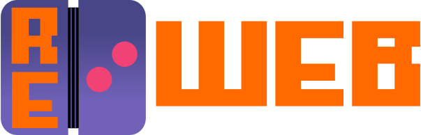

  

> [!NOTE]
> **This is not an officially supported Ntrome Ltd. or Infrared5 Inc. product.**

# Retouched Web
A Brass Monkey compatible React controller app. 

## Known Bugs
- In BC Bow Contest the X button to close the weapons menu is hard to trigger.

## License
This project is licensed under the AGPL-3.0 License.  
See the [LICENSE](LICENSE) file for details.

Images in this repository are licensed under the Creative Commons Attribution 4.0 International License.  
See the [LICENSE-IMAGES.md](LICENSE-IMAGES.md) file for details.

## Credits
The project logo uses the font ["Cosimo"](https://fontstruct.com/fontstructions/show/406218/cosimo_1) by Patrick H. Lauke (redux),  
licensed under [Creative Commons Attribution 3.0 Unported](https://creativecommons.org/licenses/by/3.0/).   

The menu_sound_on.svg and menu_sound_off.svg icons are originally from Industrial Sharp UI Icons,
licensed under the MIT License.   

The menu_reset.svg icon is originally from Instructure UI Filled Interface Icons,
licensed under the MIT License.   

The server.svg icon is originally from Dripicons Line Icons by Amit Jakhu,
licensed under the [CC Attribution 4.0 International License](https://creativecommons.org/licenses/by/4.0/).
